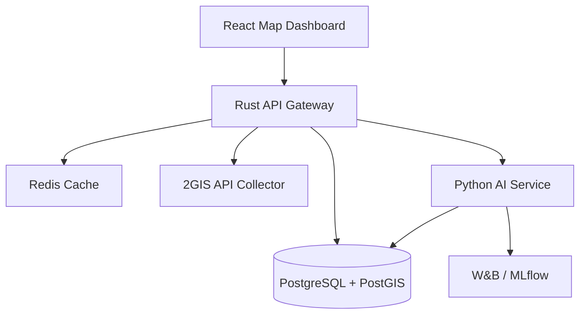

# AI-powered Urban Mobility Analytics Platform

Rust-based geospatial analytics platform using 2GIS API, PostgreSQL/PostGIS and AI services to evaluate transport accessibility, detect underserved areas, and generate route optimization recommendations.

## MVP v1 Scope

- Search and store city objects: schools, malls, hospitals, stops, hubs, stations.
- Build route records between city areas or objects.
- Calculate accessibility scores for districts.
- Expose heatmap-ready accessibility data.
- Generate AI recommendations for route gaps, hubs, and duplicated coverage.

## Architecture



## Repository Layout

```text
backend/          Rust Axum API gateway
ai-service/       Python FastAPI AI recommendation service
frontend/         React dashboard shell
db/               PostGIS schema and seed data
infra/            Local environment examples
```

## Quick Start

1. Copy environment variables:

```powershell
Copy-Item infra/.env.example .env
```

2. Fill in `DGIS_API_KEY` in `.env`. The default SQL database is `Urban Mobility DB`.

3. Start the whole platform:

```powershell
docker compose up --build
```

4. Open the services:

- Frontend dashboard: http://127.0.0.1:5173
- Rust API: http://127.0.0.1:8000/health
- AI service: http://127.0.0.1:8010/health
- PostgreSQL from host tools: `127.0.0.1:15432`

For local development without Docker, run services manually:

```powershell
cd backend
cargo run
```

```powershell
cd ai-service
poetry install
poetry run uvicorn app.main:app --reload --port 8010
```

```powershell
cd frontend
npm install
npm run dev
```

## Main API Endpoints

- `GET /health`
- `GET /objects?type=school`
- `POST /objects/search`
- `GET /accessibility`
- `POST /routes`
- `GET /recommendations`

## MVP Roadmap

- Week 1: Rust API, PostGIS schema, 2GIS Geocoder/Places integration.
- Week 2: Collect Almaty stops, schools, malls, hospitals, stations.
- Week 3: Route durations, nearest-stop metrics, baseline accessibility score.
- Week 4: AI recommendations, dashboard heatmap, experiment logging.
